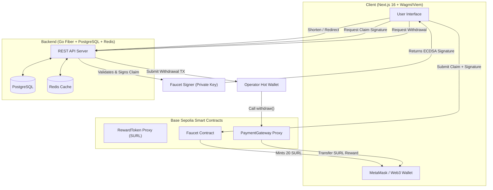

# 🔗 URL Shortener with Web3 Rewards (Go + Next.js + Solidity)

A premium, production-grade URL shortener featuring JWT authentication, real-time analytics, QR codes, an interactive 3D globe visualization, and a fully integrated **Web3 Referral Reward System** built on **Base Sepolia** using secure UUPS Upgradeable Smart Contracts.

---

## 🏗️ System Architecture

The following diagram illustrates how the frontend, Go backend, and Base Sepolia smart contracts interact to perform gasless off-chain faucet claims and automated reward withdrawals:



---

## 🛠️ Technology Stack

| Layer | Technology |
| :--- | :--- |
| **Backend** | Go 1.26+, Fiber v2, PostgreSQL, Redis, sqlc |
| **Frontend** | Next.js 16, TypeScript, Vanilla CSS, TanStack Query, react-globe.gl, Wagmi, Viem |
| **Web3 / Smart Contracts** | Solidity 0.8.35, Hardhat, OpenZeppelin Upgradeable (UUPS), ERC1967 |
| **Infrastructure** | Docker Compose, Nginx (Reverse Proxy), golang-migrate |

---

## ⚡ Key Features

* **Auth & Session** — Register/login with JWT (15-min access token + 7-day secure HttpOnly refresh cookie).
* **Analytics Engine** — Country, device, browser, and referrer tracking paired with an interactive 3D globe visualization of click distributions.
* **Rate Limiting** — Sliding window per IP rate limiting powered by Redis.
* **QR Code Generation** — Clean, on-the-fly QR code generation for shortened links.
* **Web3 Referral Rewards (`SURL`)** — Complete custom ERC20 reward token with a strictly enforced **20 Billion hard supply cap**.
* **Gasless Faucet Claims** — Users claim starting rewards by requesting cryptographic signatures from the Go backend and submitting them to the `Faucet` contract (paying zero gas for signatures).
* **Automated Withdrawals** — The Go backend acts as an oracle, automatically sending reward payouts through a secure `Operator` hot wallet when users cash out their analytics points.

---

## 🚀 Step 1: Web3 Contract Configuration & Deployment

Your smart contracts are upgradeable UUPS proxies. We use a **decoupled deployment pattern** to separate core utility deployment from NFT asset preparation and deployment. This prevents core financial redeployments if only the NFT config changes, and ensures a clean production deployment.

### 1. Configure the Web3 Environment
Copy and configure the environment variables in `web3-token/.env`:

```bash
cd web3-token
cp .env.example .env
```

Fill in your configurations:
```ini
RPC_URL=https://base-sepolia.infura.io/v3/YOUR_INFURA_PROJECT_ID
DEPLOYER_PRIVATE_KEY=0x... # Hot wallet used to send deployment transactions
OWNER_ADDRESS=0x...        # Secure Cold Wallet (e.g. Ledger / Gnosis Multi-Sig)
FAUCET_SIGNER_PUBLIC_ADDRESS=0x... # Address used by backend to sign claim messages
OPERATOR_SIGNER_PUBLIC_ADDRESS=0x... # Address used by backend to submit withdrawal transactions
ETHERSCAN_API_KEY=YOUR_BASESCAN_API_KEY
```

### 2. Upload NFT Assets to IPFS
Run the asset uploader to upload the premium 3D NFT pass video and generate the metadata CID:

```bash
npx hardhat run scripts/upload-assets.ts
```

Copy the generated **Metadata URI** (`ipfs://Qm...`) and save it in `web3-token/config.ts` under `NFT_PASS_CONFIG.metadataURI`.

### 3. Deploy Core Contracts to Base Sepolia
Run the core deployment script:

```bash
npx hardhat run scripts/deploy-core.ts --network remote
```

#### What this script executes:
1. Deploys the `RewardToken` and `PaymentGateway` proxies with temporary Deployer administrative permissions.
2. Deploys the `Faucet` contract.
3. Mints **1,000,000 SURL** directly to the `Faucet` contract.
4. Mints **1,000,000 SURL** directly to the `Operator` hot wallet.
5. Mints **19,998,000,000 SURL** (the remaining supply cap) directly to your secure cold **Owner** wallet.
6. Transfers **100% of permanent administrative ownership** of both contracts to your secure cold **Owner** wallet.
7. Automatically saves all deployed coordinates into `web3-token/deployed-addresses.txt`.

### 4. Deploy NFT Pass Contract to Base Sepolia
Update your `web3-token/config.ts` file under `PRODUCTION_ADDRESSES` with the newly generated `RewardToken` proxy address (taken from `deployed-addresses.txt`):

```typescript
export const PRODUCTION_ADDRESSES = {
  token: "0x...", // Paste RewardToken proxy address here
  payment: "",
  faucet: "",
  nftPass: "",
};
```

Then deploy the `NFTPass` contract:

```bash
npx hardhat run scripts/deploy-nft.ts --network remote
```

### 5. Upgrading RewardToken to V2 (Votes) in Production

If you need to upgrade the already deployed `RewardToken` proxy to `RewardTokenV2` on a remote/production network:

1. **Check Ownership**: Make sure the private key executing the upgrade transaction belongs to the current **owner** of the proxy contract (since `_authorizeUpgrade` checks `onlyOwner`). If the owner is a cold wallet or multi-sig, the upgrade proposal must be routed through that owner account.
2. **Run the upgrade script**: Set the `PROXY_ADDRESS` env variable to your token proxy address and execute the upgrade script:

```bash
PROXY_ADDRESS=0xYOUR_DEPLOYED_PROXY_ADDRESS npx hardhat run scripts/upgrade-v2-votes.ts --network remote
```

This deploys the `RewardTokenV2` implementation and updates the proxy pointer, enabling voting and delegation capabilities.

---

## 🔗 Step 2: Basescan Verification & Proxy Linking

Since the Solidity contract files do not change, Etherscan/Basescan **instantly auto-verifies** your new deployments due to bytecode matching! The only action you need to perform is linking the proxies:

### How to Link UUPS Proxies on Basescan:
1. **Link the RewardToken Proxy**:
   * Open your deployed `RewardToken` proxy address on Basescan.
   * Navigate to the **Contract** tab.
   * Click **More Options** (the three dots on the right) and select **Is this a proxy?**.
   * Click **Verify** and then **Save**.
2. **Link the PaymentGateway Proxy**:
   * Open your deployed `PaymentGateway` proxy address on Basescan.
   * Navigate to the **Contract** tab.
   * Click **More Options** and select **Is this a proxy?**.
   * Click **Verify** and then **Save**.

Once completed, the **"Write as Proxy"** tab will be fully unlocked, allowing direct interactions!

---

## 🐳 Step 3: Local Production Stack Setup

Once your on-chain contracts are deployed and configured, we spin up the backend, frontend, databases, and reverse proxy locally via Docker.

### 1. Populate the Go Backend Environment
Copy the environment template in the `backend/` folder and insert your freshly generated smart contract addresses:

```bash
cd ../backend
cp .env.example .env
```

Update your `.env` variables under the Web3 section:
```ini
# --- Web3 / Blockchain Configurations (Base Sepolia) ---
NODE_RPC_URL=https://base-sepolia.infura.io/v3/YOUR_INFURA_PROJECT_ID
CHAIN_RPC_URL=https://base-sepolia.infura.io/v3/YOUR_INFURA_PROJECT_ID
CHAIN_ID=84532
CHAIN_NAME="Base Sepolia"
EXPLORER_URL=https://sepolia.basescan.org

CONTRACT_TOKEN=0x...   # RewardToken Proxy Address
CONTRACT_PAYMENT=0x... # PaymentGateway Proxy Address
CONTRACT_FAUCET=0x...  # Faucet Contract Address
OWNER_ADDRESS=0x...    # Owner Wallet Address

# Private Keys
OPERATOR_PRIVATE_KEY=0x... # Private Key for Operator Hot Wallet (needs Base Sepolia ETH)
FAUCET_SIGNER_KEY=0x...    # Private Key for Faucet Signer Wallet
```

> [!IMPORTANT]
> **Operator Gas Fees**: The Operator Hot Wallet must hold a tiny amount of Base Sepolia ETH (e.g. `0.05` or `0.1` ETH) to pay for withdrawal transaction gas on the blockchain. You can get free testnet ETH from [QuickNode Faucet](https://faucet.quicknode.com/base/sepolia) or [Base Faucet](https://basefaucet.com).

### 2. Launch the Containers
From the root workspace directory, build and launch the production stack:

```bash
docker compose -f docker-compose.prod.yml up -d --build
```

### 3. Run Database Migrations
Create the SQL tables by applying pending migrations inside the PostgreSQL container:

```bash
docker compose -f docker-compose.prod.yml run --rm migrate
```

Your app is now live and fully connected at **`http://localhost`**!

---

## 🗃️ Database Migrations Management

Migrations are powered by [golang-migrate](https://github.com/golang-migrate/migrate). All migration scripts live in `backend/db/migrations/`.

```bash
# Apply pending migrations (Dev)
docker compose -f docker-compose.dev.yml run --rm migrate

# Rollback the last applied migration
docker compose -f docker-compose.prod.yml run --rm migrate -- sh -c \
  'migrate -path=/migrations/ -database "postgres://$${DB_USER}:$${DB_PASSWORD}@db:$${DB_PORT}/$${DB_NAME}?sslmode=disable" down 1'
```

---

## 📡 API Reference

### 🔐 Authentication (Public)
```http
POST /api/auth/register     - Register a new account
POST /api/auth/login        - Login (Returns JWT + HttpOnly refresh cookie)
POST /api/auth/refresh      - Silent JWT access token refresh
POST /api/auth/logout       - Clear JWT cookies
```

### 🔗 Link Management (Authenticated)
```http
POST   /api/links           - Shorten a new URL (with custom alias/expiry)
GET    /api/links           - List all created links for the user
GET    /api/links/:slug     - Retrieve detail stats for a specific link
DELETE /api/links/:slug     - Delete a link
GET    /api/links/:slug/qr  - Generate QR code PNG
```

### 📈 Web3 Claims & Withdrawals (Authenticated)
```http
POST   /api/web3/claim-sig  - Requests faucet claim signature from Backend
POST   /api/web3/withdraw   - Triggers operator wallet to send SURL to user wallet
```

---

## 🧪 Running Tests

```bash
# Run Go backend unit tests
cd backend && go test ./...

# Run Next.js frontend checks
cd frontend && bun run lint
```

## 📄 License

This project is licensed under the MIT License - see the [LICENSE](LICENSE) file for details.